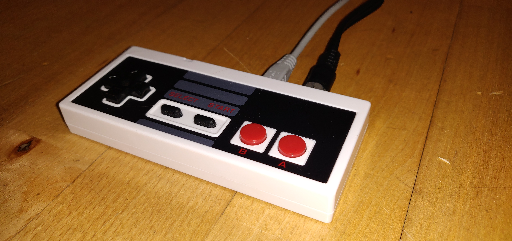
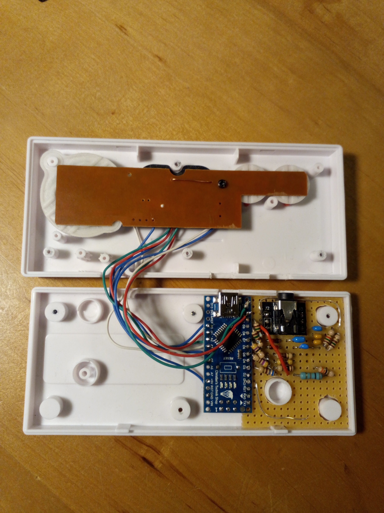
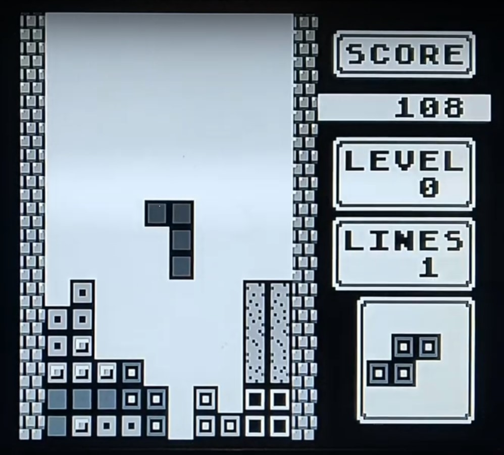

# ArduinoGameConsole
A minimal solution to create audio and video with an Arduino Nano

I wanted to build a game console into the case of a small USB game pad (a NES controler look-alike).
To make the work a challenge, I wanted to only use an Arduino Nano clocked at 16 Mhz and some passive 
components (diodes are OK) and create the best possible video and audio signal that is
imaginable with such restrictions.

As it turned out, a monochrome 288p video signal with 4 gray scales is possible when 
progamming the controller at machine level. 4-channel music is also possible.

My game of choice is Tetris in a version that comes pretty close to the original 
GameBoy version with a very similar audio track.

For a short demonstration can be found on https://www.youtube.com/watch?v=HPVpsAUs4aY .
The screen flicker is caused by the phone camera. In reality the picture looks super stable. 

